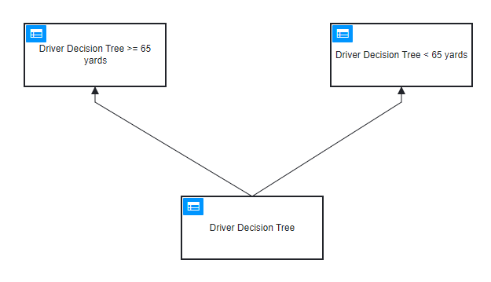

# Testing DMN



## Test the DMN
```java

@Test
void testDriverDecisionTree() {
    DmnEngine dmnEngine = DmnEngineConfiguration.createDefaultDmnEngineConfiguration().buildEngine();
    InputStream inputStream = getClass().getClassLoader().getResourceAsStream("driver_decision_tree.dmn");

    List<DmnDecision> dmnDecisions = dmnEngine.parseDecisions(inputStream);

    DmnDecision dmnDecisionMoreThan65 = dmnDecisions.stream().filter(dmnDecision -> dmnDecision.getKey().equals("Driver_Decision_Tree_more_65_Decision")).findFirst().orElseThrow(NoSuchElementException::new);
    DmnDecision dmnDecisionLessThan65 = dmnDecisions.stream().filter(dmnDecision -> dmnDecision.getKey().equals("Driver_Decision_Tree_less_65_Decision")).findFirst().orElseThrow(NoSuchElementException::new);

    VariableMap variables = Variables.createVariables()
            .putValue("yards", 70)
            .putValue("fairwayLessThan40yards", true)
            .putValue("woodRemovesHazard", false)
            .putValue("nextClubRemoveHazard", false)
            .putValue("canCarryHazardWithoutTrouble", false)
            .putValue("woodInHazard", true);

    DmnDecisionTableResult dmnDecisionRuleResultsMoreThan65 = dmnEngine.evaluateDecisionTable(dmnDecisionMoreThan65, variables);
    DmnDecisionTableResult dmnDecisionRuleResultsLessThan65 = dmnEngine.evaluateDecisionTable(dmnDecisionLessThan65, variables);

    assertThat(dmnDecisionRuleResultsMoreThan65).hasSize(1);
    assertThat(dmnDecisionRuleResultsLessThan65).hasSize(1);
    System.out.println(">65: " + dmnDecisionRuleResultsMoreThan65);
    System.out.println("<65: " + dmnDecisionRuleResultsLessThan65);
}
```

## needed dependency when not using the engine

```xml
<properties>
    <juel.version>2.2.7</juel.version>
</properties>
<dependency>
    <groupId>de.odysseus.juel</groupId>
    <artifactId>juel-api</artifactId>
    <version>${juel.version}</version>
    <scope>test</scope>
</dependency>
<dependency>
    <groupId>de.odysseus.juel</groupId>
    <artifactId>juel-impl</artifactId>
    <version>${juel.version}</version>
    <scope>test</scope>
</dependency>
<dependency>
    <groupId>de.odysseus.juel</groupId>
    <artifactId>juel-spi</artifactId>
    <version>${juel.version}</version>
    <scope>test</scope>
</dependency>
```