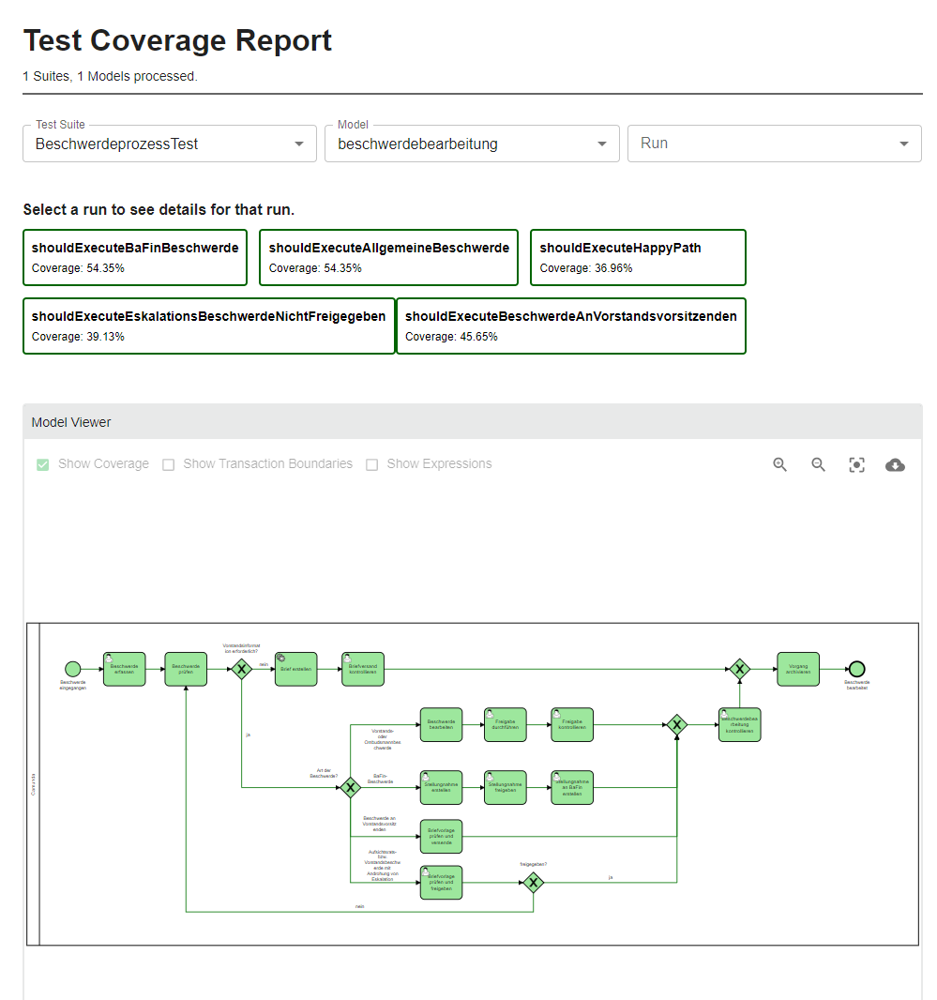

# JUnit 5 Testing
## pom.xml
Benötigt wird die JUnit5 Dependency, die JUnit5-Camunda Dependency und die Testcoverage (wenn gewünscht). AssertJ ist 
bei start.camunda.com nicht standardmäßig in der pom dabei.
```xml
<dependency>
    <groupId>org.camunda.bpm.extension</groupId>
    <artifactId>camunda-bpm-junit5</artifactId>
    <version>${camunda-bpm-junit5.version}</version>
    <scope>test</scope>
</dependency>

<dependency>
    <groupId>org.camunda.bpm.extension</groupId>
    <artifactId>camunda-bpm-process-test-coverage-junit5</artifactId>
    <version>1.0.3</version>
    <scope>test</scope>
</dependency>

<dependency>
    <groupId>org.junit.jupiter</groupId>
    <artifactId>junit-jupiter</artifactId>
    <scope>test</scope>
</dependency>

<dependency>
    <groupId>org.assertj</groupId>
    <artifactId>assertj-core</artifactId>
</dependency>
```

## Camunda Test Konfiguration
Die Engine wird ohne JobExecutor betrieben. Dazu in den Ressources eine camunda.cfg.xml ablegen. Hier ist auch die
Referenz auf die Testengine (InMemory bzw. mit TestCoverage) definiert. [camunda.cfg.xml](src/test/resources/camunda.cfg.xml)

```xml
<beans xmlns="http://www.springframework.org/schema/beans"
       xmlns:xsi="http://www.w3.org/2001/XMLSchema-instance"
       xsi:schemaLocation="http://www.springframework.org/schema/beans   http://www.springframework.org/schema/beans/spring-beans.xsd">

    <bean id="processEngineConfiguration"
          class="org.camunda.bpm.extension.process_test_coverage.engine.ProcessCoverageInMemProcessEngineConfiguration">
<!--    <bean id="processEngineConfiguration" class="org.camunda.bpm.engine.impl.cfg.StandaloneInMemProcessEngineConfiguration">-->
        <property name="jdbcUrl" value="jdbc:h2:mem:camunda;DB_CLOSE_DELAY=1000" />
        <property name="jdbcDriver" value="org.h2.Driver" />
        <property name="jdbcUsername" value="sa" />
        <property name="jdbcPassword" value="" />

        <!-- Database configurations -->
        <property name="databaseSchemaUpdate" value="true" />

        <!-- job executor configurations -->
        <property name="jobExecutorActivate" value="false" />

        <property name="history" value="full" />
    </bean>
</beans>
```

## Testklasse
Die Testklasse muss mit der entsprechenden ProcessEngineExtension extended werden. Es geht auch mit 
ProcessEngineExtension - dann wird allerdings kein Report generiert.

Die @Deployment-Annotation kann auch auf Methodenebene angegeben werden.
```java
@ExtendWith(ProcessEngineCoverageExtension.class)
@Deployment(resources = {"beschwerdeprozess_mixed.bpmn"})
```

### Mocking der Delegates, Listener usw.
```java
@Mock
private BriefErstellenDelegate briefErstellenDelegate;
@Mock
private AdonisAPIListener adonisAPIListener;

@BeforeEach
void init() {
    MockitoAnnotations.openMocks(this);
    Mocks.register("briefErstellenDelegate", briefErstellenDelegate);
    Mocks.register("adonisAPIListener", adonisAPIListener);
}
```

### Beispiel Testcase
```java
@Test
void shouldExecuteBaFinBeschwerde() {
    Map<String, Object> startVariables = Map.of("beschwerde", "BaFin Beschwerde");
    ProcessInstance processInstance = runtimeService().startProcessInstanceByKey(BESCHWERDEPROZESS, startVariables);
    assertThat(processInstance).isActive();
    assertThat(processInstanceQuery().count()).isEqualTo(1);
    assertThat(task(processInstance)).isNotNull();
    Map<String, Object> beschwerdeErfassungVariables = Map.of(
            "isVorstandsbeschwerde", true,
            "beschwerdeart", "bafinBeschwerde");
    complete(task(processInstance), beschwerdeErfassungVariables);
    assertThat(task(processInstance)).isNotNull();
    complete(task(processInstance));
    assertThat(task(processInstance)).isNotNull();
    Map<String, Object> stellungnahmeFreigebenVariables = Map.of(
            "controlexecution_documentation", "Dokumentation Vorstandsvorsitzender",
            "controlexecution_comment", "Kommentar Vorstandsvorsitzender",
            "controlexecution_isApproved", true);
    complete(task(processInstance), stellungnahmeFreigebenVariables);
    assertThat(task(processInstance)).isNotNull();
    complete(task(processInstance));
    Map<String, Object> leiterBeschwerdemanagementVariables = Map.of(
            "controlexecution_documentation", "Dokumentation LBM",
            "controlexecution_comment", "Kommentar LBM",
            "controlexecution_isApproved", true);
    complete(task(processInstance), leiterBeschwerdemanagementVariables);
    assertThat(processInstance).isEnded();
}
```
## Testergebnis
Neben dem JUnit-Testergebnis wird im target-Folder auch ein html Bericht erstellt:
[report.html (nur nach durchgeführtem Test)](/target/process-test-coverage/info.maxbehr.process.BeschwerdeprozessTest/report.html)



## Prozesstests mitten im Prozess starten
[Testklasse](/src/test/java/info/maxbehr/process/MittendrinProzessTest.java)
```java
ProcessInstance processInstance = runtimeService()
    .createProcessInstanceByKey(BESCHWERDEPROZESS)
    .startBeforeActivity("UT_Briefversand_kontrollieren")
    .setVariable("beschwerde", "Beschwerde")
    .execute();
```
Es ist zu beachten, dass Usertasks, die vor dem Startpunkt liegen trotzdem als
aktiv von TaskserviceQueries gefunden werden.

## AssertJ und Camunda BPM Assert gleichzeitig
In case you want to combine Camunda Platform Assert with the assertions provided by AssertJ, your imports should look like this:

```java
import static org.assertj.core.api.Assertions.*;
import static org.camunda.bpm.engine.test.assertions.ProcessEngineTests.*;
```